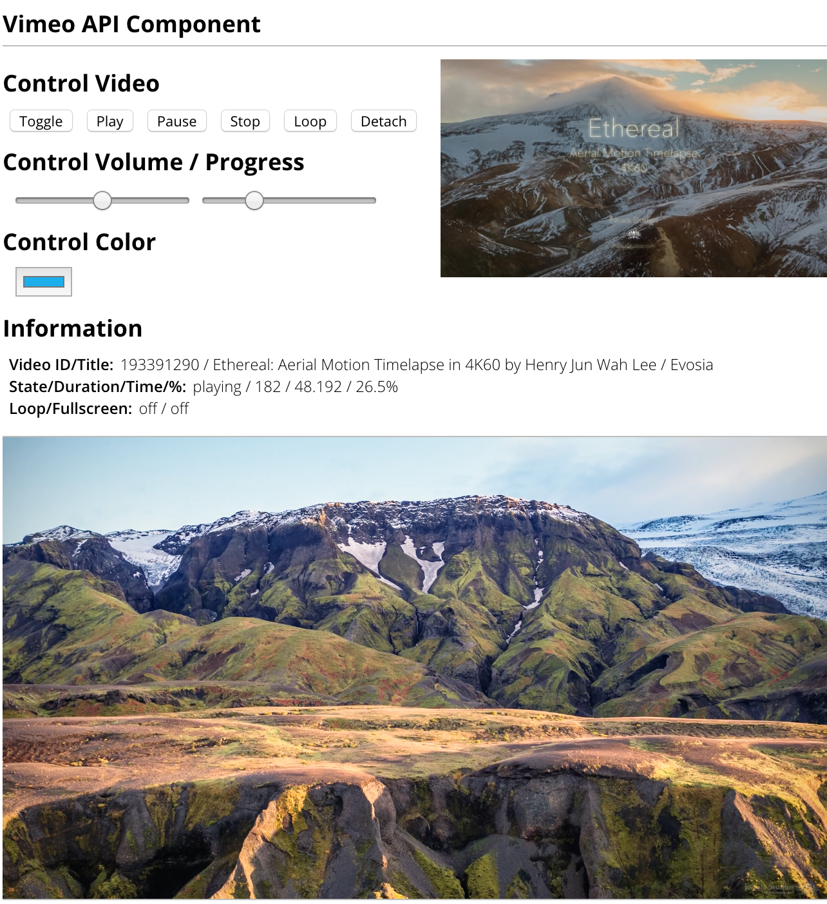

[](https://www.npmjs.com/package/react-tj-vimeo) [](LICENSE)

# react-tj-vimeo

## Example

```bash
npm install
cd examples && npm install
npm start
```

Then open http://localhost:3000 in a browser.

## Install

```bash
npm install react-tj-vimeo
```

## Screenshot



## License

MIT, see the [LICENSE](LICENSE) file for detail.
